# Azure DevOps (Paid) – Key Capabilities

This guide highlights **practical benefits and features of Azure DevOps (Paid)**, emphasizing pull requests, boards, CI visibility, and migration considerations. Images are included to give visual context based on our research.

---

## Pull Requests

Azure DevOps provides transparency and control over code reviews:

* **Force Push Detection** – PRs clearly indicate force pushes, making history rewrites visible and auditable.  
  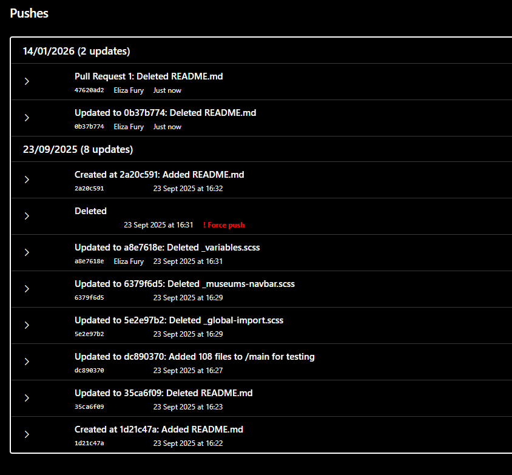

* **Commit History** – Full commit history is available directly in the PR, improving review context.  
  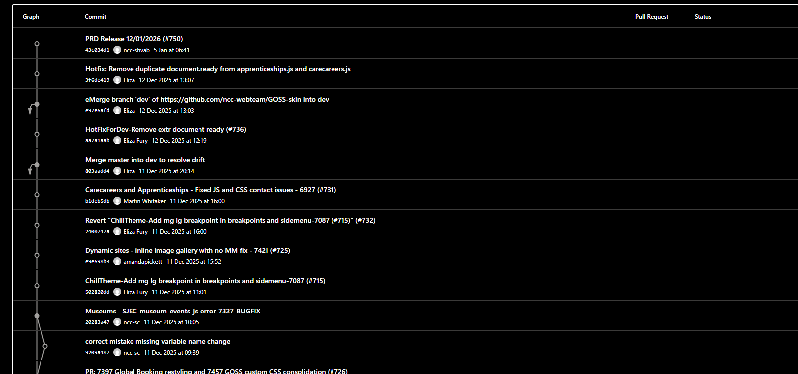

* **Reviews and Approvals** – All PR review activity and approvals are tracked over time.   
  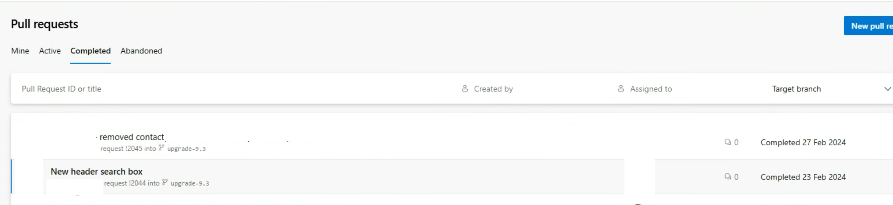

* **PR Updates via Notifications** – New commits, status changes, and review activity can be sent via email notifications.  
  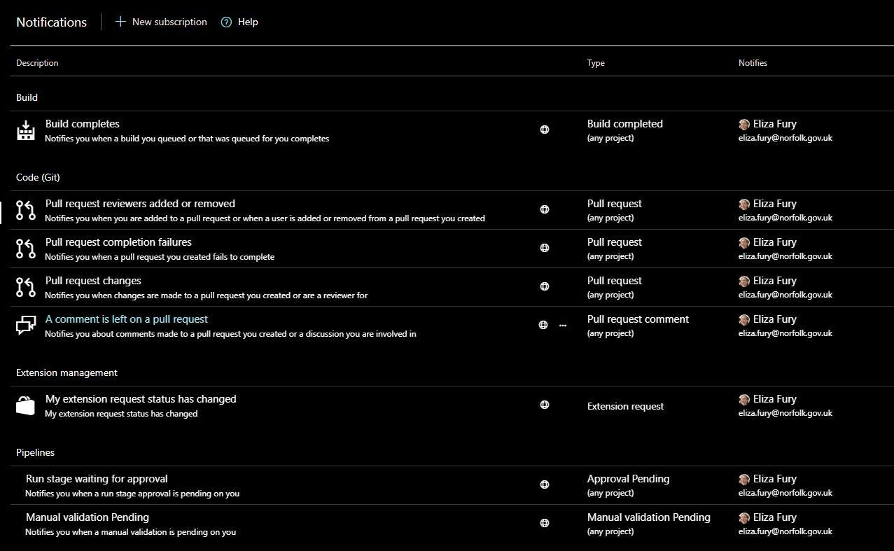

* **Cherry-Pick and Squash Options** – PRs support cherry-pick and squash merge strategies.  
  

* **All Required Checks Visible** – PRs show whether all required builds and checks succeeded.  
  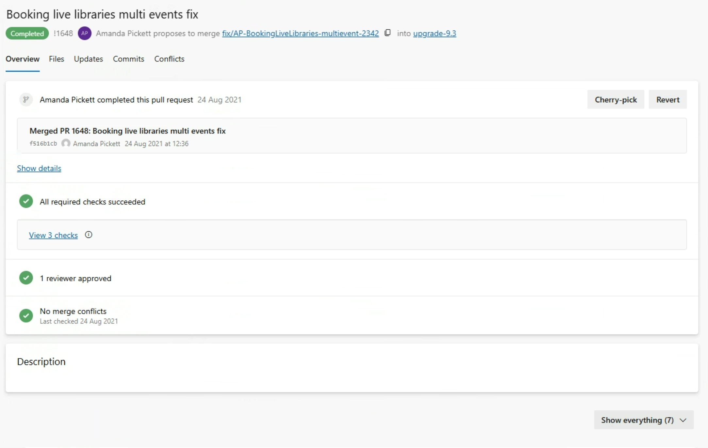  

---

## Azure Boards

Azure Boards integrates planning, work tracking, and traceability:

* **Work Items Linked to Commits & PRs** – Maintains traceability for code and work items.  
  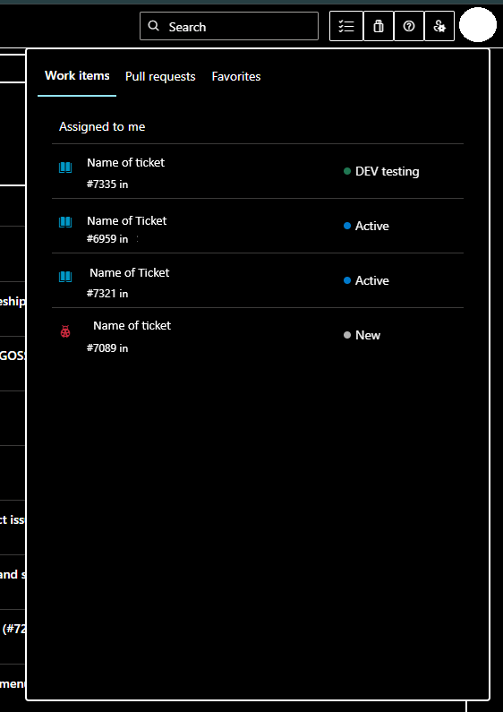

* **Boards Can Be Mirrored to GitHub** – Migration risk is low, when deciding to switch from Github to Azure DevOps.  
  

* **Retrospectives & Planning** – Tools for team retrospectives and planning.  
  

* **Organizational Settings** – Teams can configure permissions, policies, and workflows.  
  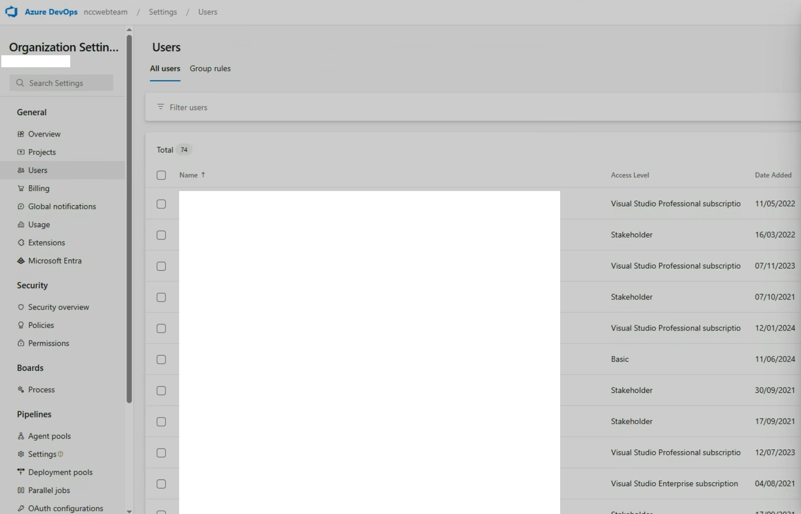

---

## Build & CI Visibility

CI/CD pipelines in Azure DevOps provide clear insights into build and deployment status:

* **Pipeline Overview** – Build pipelines are easy to navigate and monitor.  
  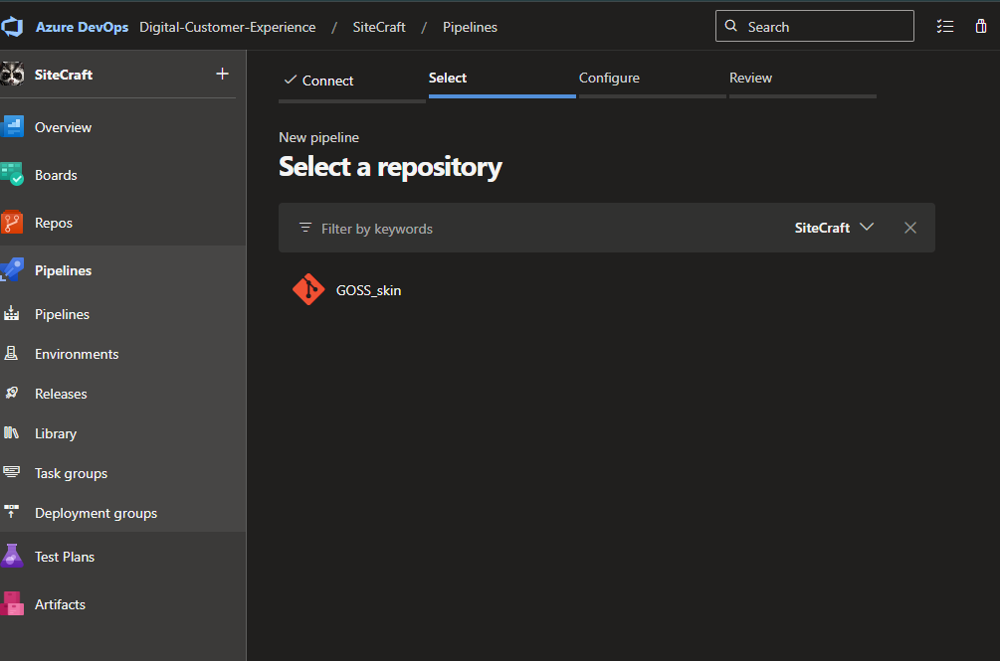

* **Build Status on PRs** – Pull requests  can clearly show if builds pass or fail.  
  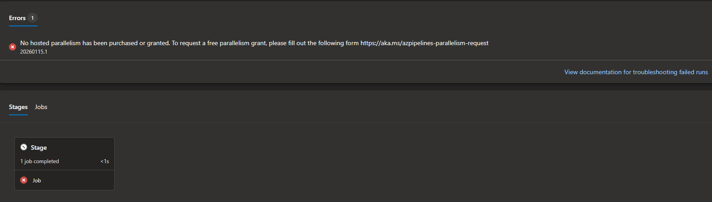  
  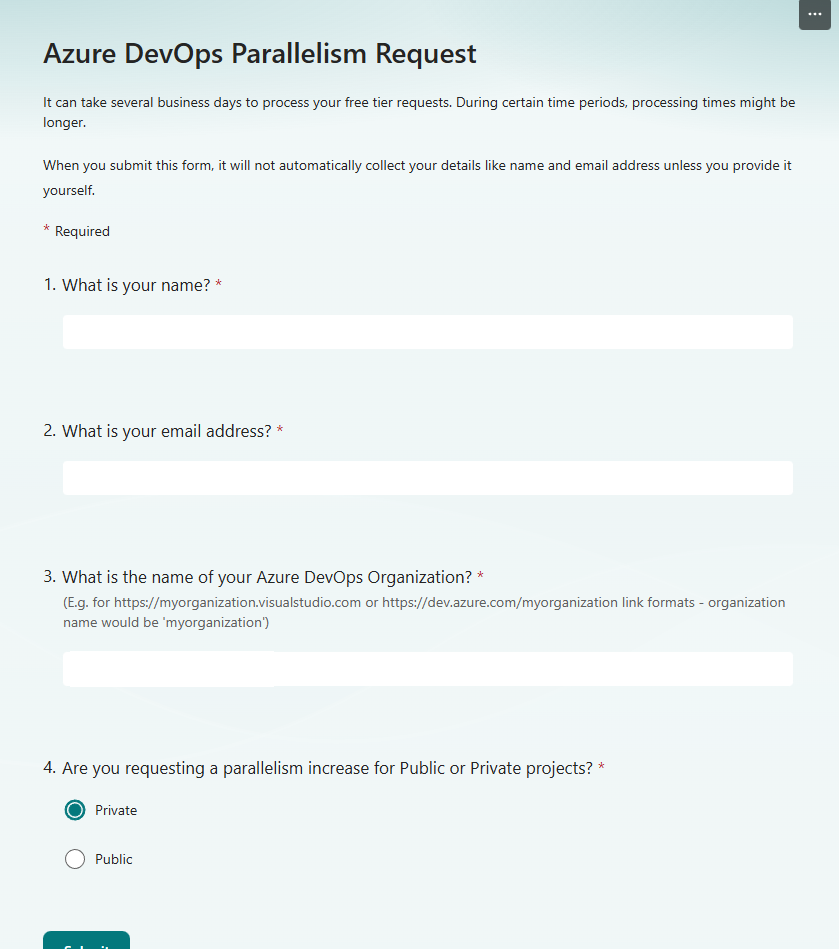

* **Code Quality Checks** – Can have integrated code quality and static analysis.  
  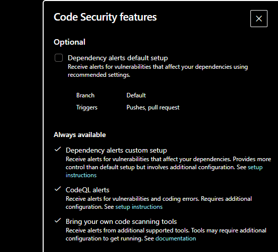

* **Historical Build Results** – Builds and artifacts remain accessible for auditing or troubleshooting.  
  

## Running CI for Multiple PRs (Simple Explanation)

When two Pull Requests are opened or updated at the same time, each PR triggers the CI pipeline.

- If only **one parallel job** is available, Azure DevOps will:
  - Run one PR pipeline
  - Queue the other until the first finishes

- If **two parallel jobs** are available, Azure DevOps will:
  - Run both PR pipelines at the same time

It does not matter whether the PRs use:
- The same pipeline or different pipelines
- The same repository or different repositories
- The same or different branches

What matters is how many pipelines are running **at the same time**.

---

## Parallel Jobs and Cost

- Azure DevOps includes **1 free self-hosted parallel job**
- This allows **one pipeline to run at a time**
- To run **two PR pipelines simultaneously**, you need:
  - **1 additional self-hosted parallel job**

**Cost:** $15 per month  
**Minutes:** Unlimited

 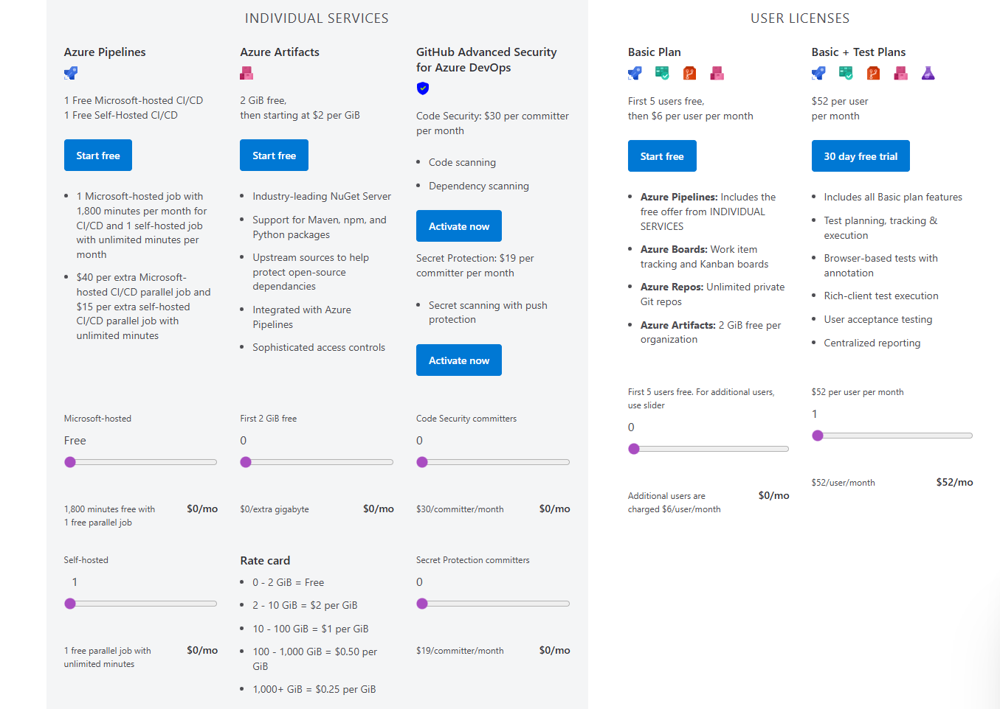

---

## What Needs to Be Set Up

To run two pipelines at the same time:
- You must have **two self-hosted agents running**
- Buying a parallel job only allows concurrency; it does not create agents

In short:
- **Parallel job = permission to run**
- **Agent = machine that does the work**

We need both.

---

## Practical Recommendation

If CI jobs are short (a few minutes), queueing is usually fine.  
If CI jobs are long or frequently overlap, adding one parallel job improves developer experience for a small cost.

---

## Repository & Branch Management

Azure DevOps gives developers visibility and control over repositories:

* **Graphical Repository Views** – Clear visualization of branches, commits, and PRs.  
  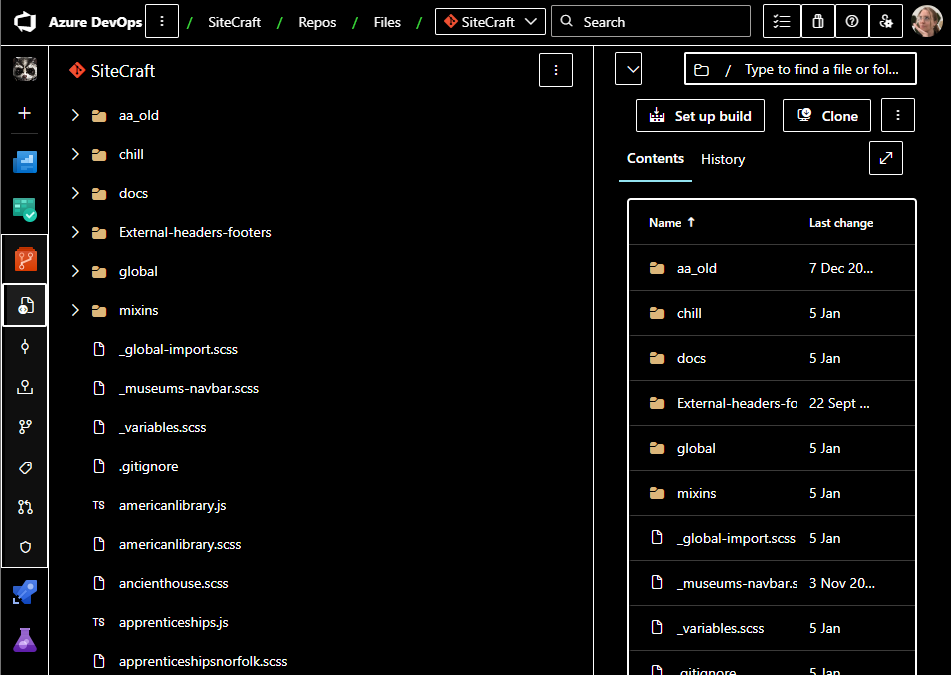  
  

* **Repo Settings & Service Hooks** – Configure policies, integrations, and automation.  
    
  

* **Code Documentation & Readmes** – Markdown support and readme previews.  
  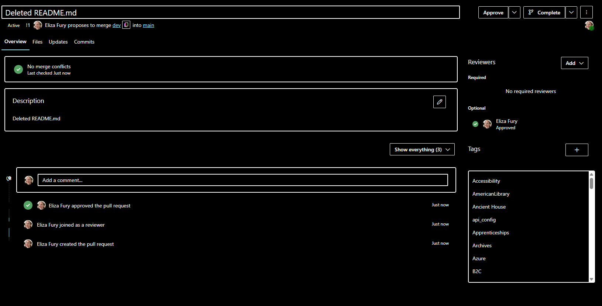

---

## Migration Considerations

* **Low Vendor Lock-In** – Repos and boards can be mirrored to GitHub.  
* **Flexible Adoption** – Teams can adopt Azure DevOps for planning and CI while keeping GitHub as a long-term option.  
* **Hybrid Scenarios Supported** – Azure extensions can work with on-premises or hybrid setups.  
  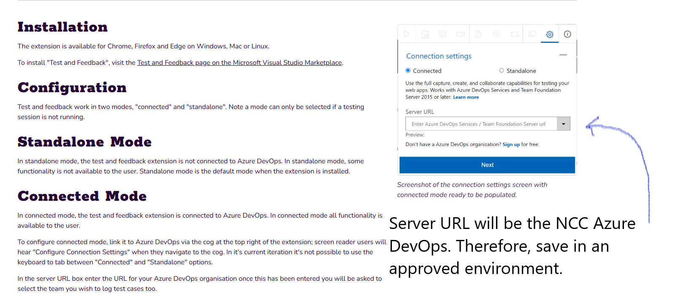  
    
  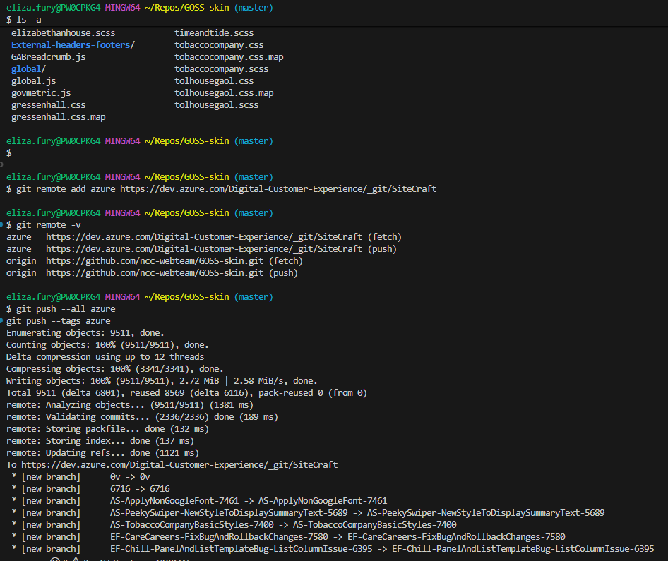  

---

**Summary:**  

Azure DevOps (Paid) provides strong **pull request transparency**, **solid CI/CD feedback**, practical **boards**, and **low-risk migration paths** to GitHub. The platform is suitable for teams that need structure and traceability without being locked in long-term.

