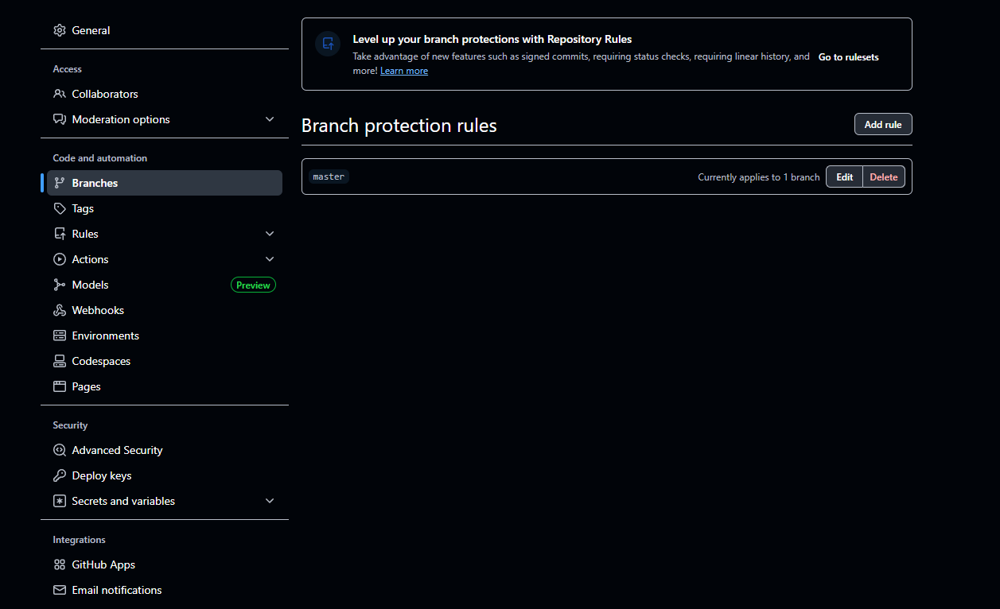
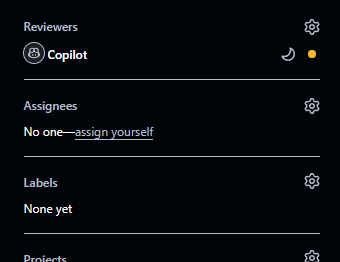
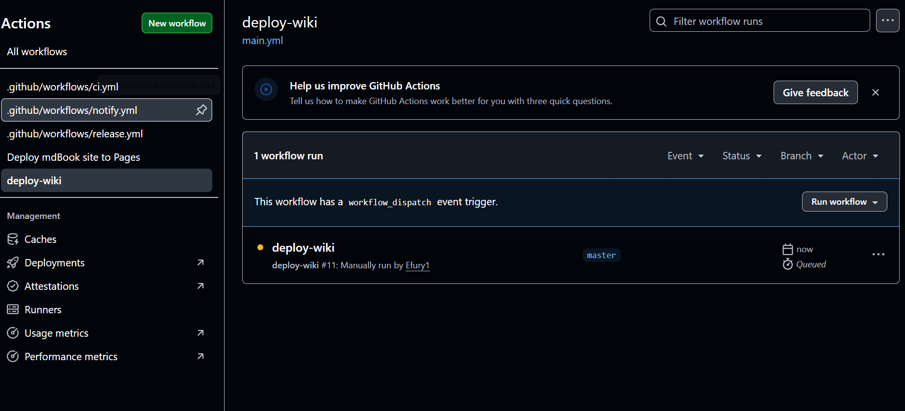
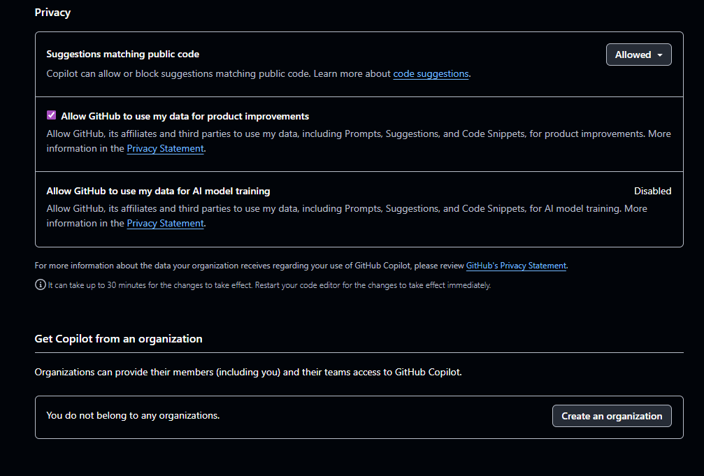
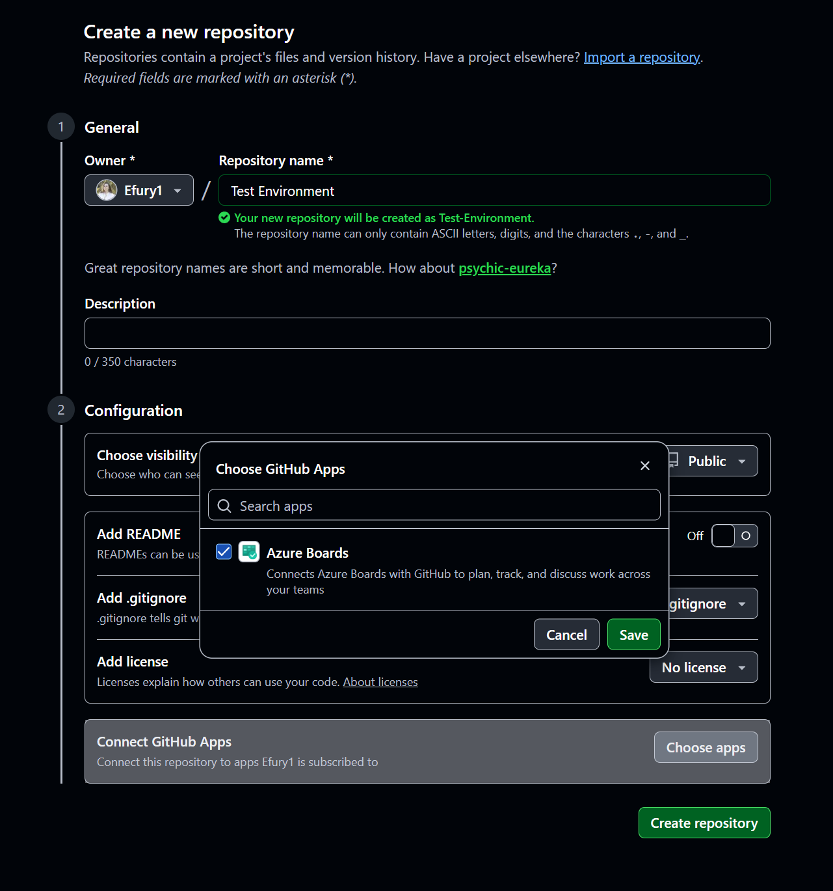
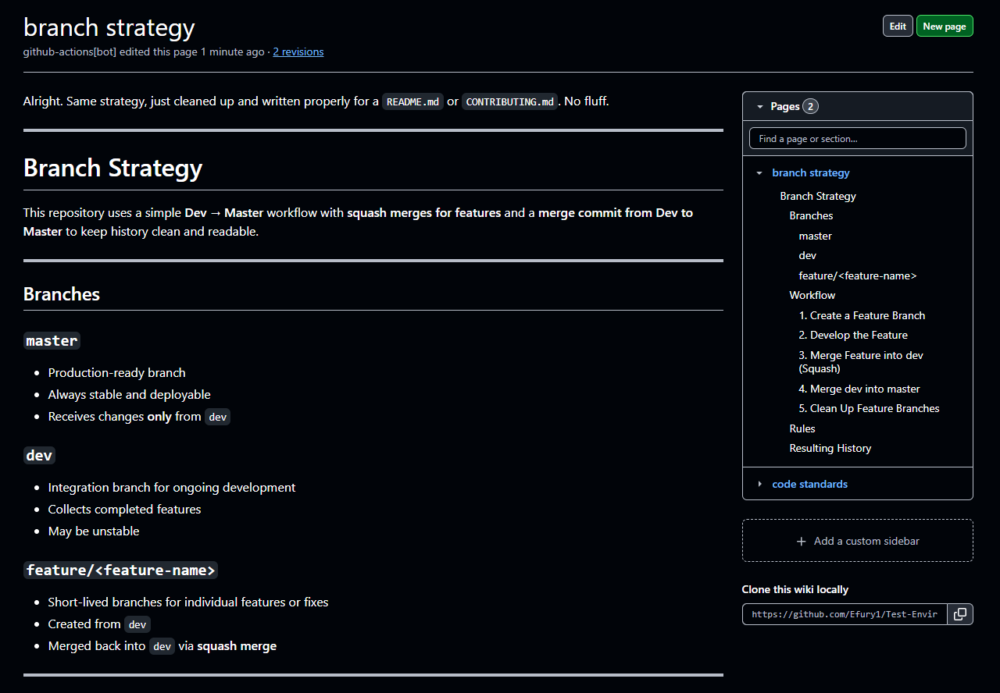
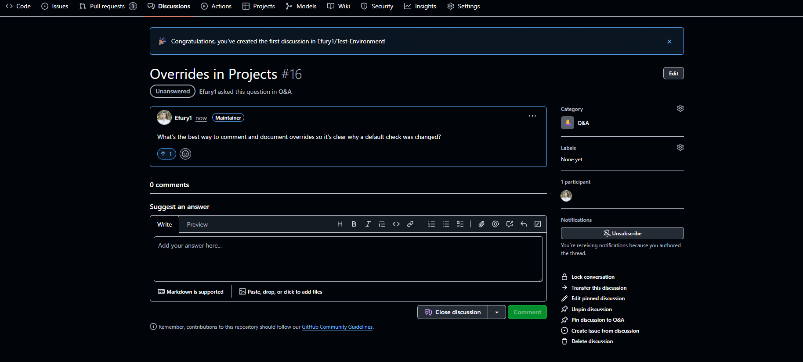
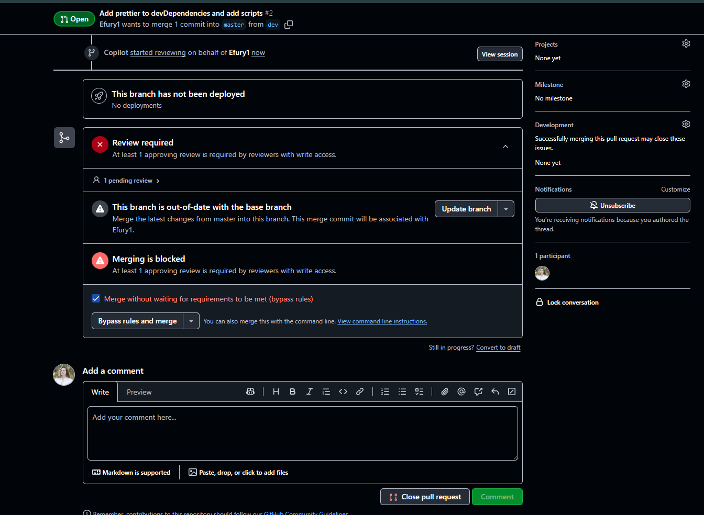
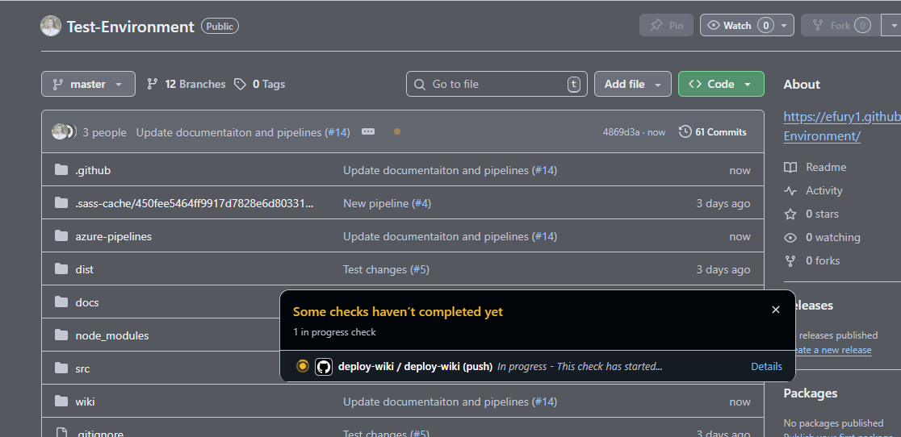
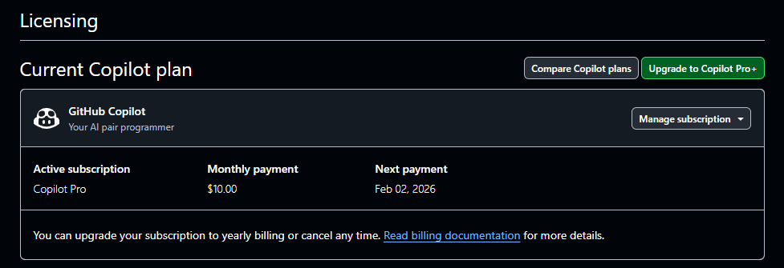

# GitHub Guide

GitHub is the place where we currently collaborate, and store our code. Below we explore the Github platform.

---

## Repository Management

Repositories are where your code lives. GitHub makes it easy to create, organize, and manage projects.

- **Free users**: Unlimited public/private repositories, but there's limitations with Github Actions.
- **Paid plans**: Offer increased storage, unlimited Github Actions minutes, advanced code analytics. This is helpful for multiple contrinutors, or enterprise level workflows. Paid plans also provide features like dependency graphs, repository insights.

**What you can do**:  

---

## Branching and Workflow Rules

Branches let you work on features or fixes without affecting the main code. GitHub supports branch naming conventions, protections, and workflow rules to enforce quality.  

- **Free users**: Can create branches and basic protections (like requiring PRs before merging).  
- **Paid plans**: Advanced branch rules, status checks, and required reviews for higher control.  

**What you can do**:  
- Protect main or release branches  
- Prevent merging without tests passing  
- Implement CI/CD rules automatically  

---

## Pull Requests (PRs) and Code Review

PRs let you propose changes and get feedback before merging code. They are essential for team collaboration.  

- **Free users**: Can create PRs, add reviewers, and use simple review workflows.  
- **Paid plans**: Can enforce multiple reviewers, use required status checks, and integrate more automation.  

**What you can do**:  
- Collaborate on code safely  
- Comment on specific lines or files  
- Automate testing before merging  

  

---

## GitHub Actions (Automation)

GitHub Actions allows you to automate tasks like testing, building, and deploying directly from your repository.  

- **Free users**: Limited minutes for workflow runs per month, enough for small projects.  
- **Paid plans**: Unlimited workflows, expanded compute capacity, and priority runners mean we can trigger PR checks the moment they arrive, and even run them concurrently.

**What you can do**:  
- Run CI/CD pipelines automatically on code changes  
- Deploy code to servers or cloud platforms  
- Automate routine tasks (e.g., formatting, labeling issues)  

  
  
  

---

## Integration with Azure DevOps

GitHub integrates with Azure DevOps, connecting your code repository to work items, boards, and project management tools.  

- **Free users**: Basic Azure integration for linking commits and issues.  
- **Paid plans**: Full access to boards, pipelines, and reporting.  

**What you can do**:  
- Track development tasks alongside your code  
- Link PRs to Azure work items  
- Search and filter work items from GitHub  

  
  

---

## Collaboration Features

GitHub promotes knowledge sharing through wikis, discussions, and issue tracking.  

- **Free users**: Can use wikis, issues, and discussions fully.  
- **Paid plans**: Advanced analytics, team insights, and private discussions.  

**What you can do**:  
- Document your project in wikis  
- Have structured discussions with teammates  
- Encourage community contributions  

  
  

---

## Merge Controls

GitHub gives you fine-grained control over how code is merged to your main branches.  

- **Free users**: Can require PRs and basic checks.  
- **Paid plans**: Require multiple approvals, wait for all checks, enforce linear history, and block merges under conditions.  

**What you can do**:  
- Ensure code quality before it reaches production  
- Prevent accidental merges  
- Customize checks to match team workflow  

  

---

## GitHub Copilot

GitHub Copilot is an AI-powered assistant that suggests code as you type. It can speed up development and help you learn new patterns.  

- **Free trial available**, paid subscription unlocks full capabilities.  

**What you can do**:  
- Auto-complete lines or entire functions  
- Generate boilerplate code quickly  
- Learn new syntax or libraries faster  

---

## Summary

GitHub is powerful because it combines version control, collaboration, automation, and integrations all in one platform. By leveraging branching rules, PR reviews, Actions, and integrations, teams can maintain high code quality, accelerate development, and scale their projects efficiently. Free plans are surprisingly capable, but paid options unlock advanced workflows, better insights, and more automation for teams.
