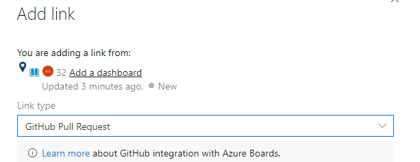
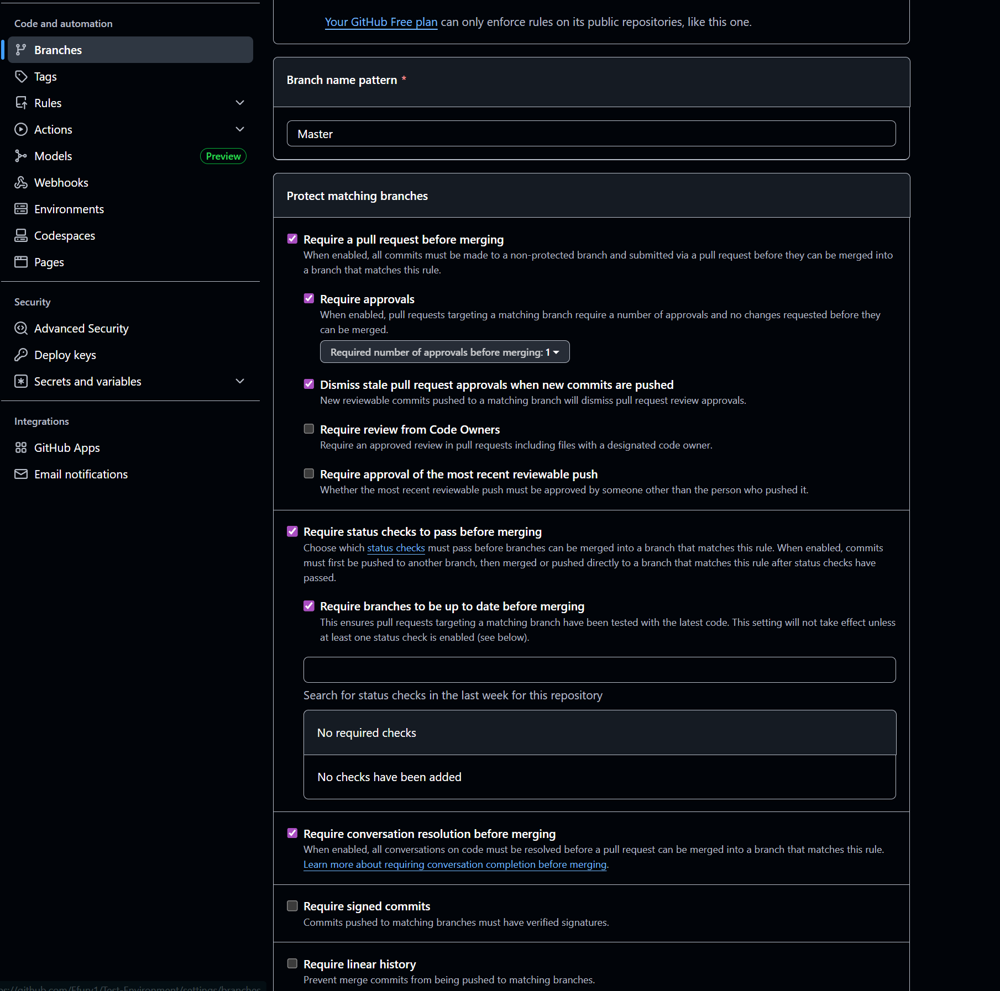
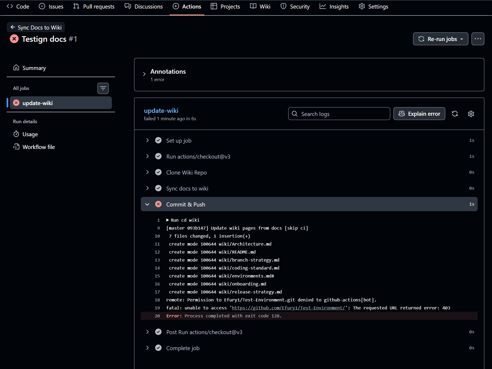
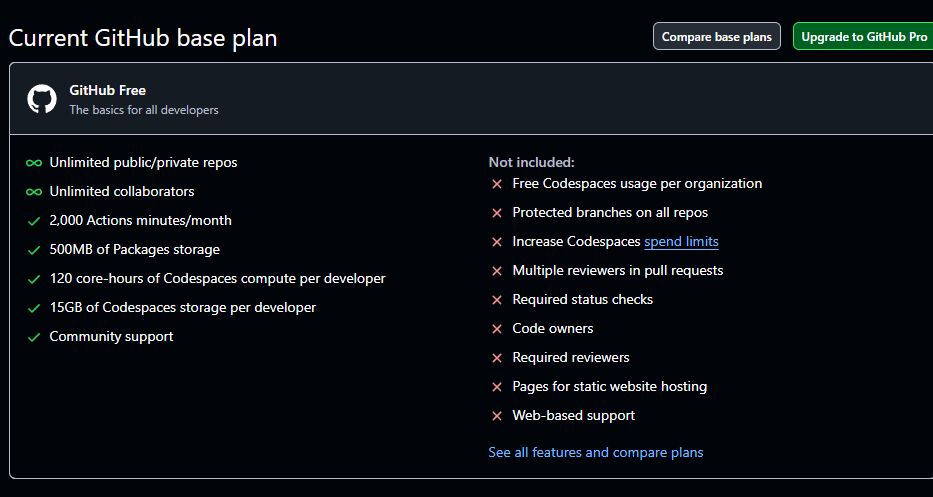

# GitHub Guide

GitHub is the leading platform for hosting, reviewing, and collaborating on code. This guide will cover its benefits, key workflows, and pros and cons, with visuals to illustrate each feature.

---

## Benefits of GitHub

### 1. Repository Management
GitHub makes it easy to create, organize, and manage code repositories.

### 2. Branching and Workflow Rules
GitHub supports conventional branch naming, protections, and workflow rules to enforce code quality.

  

### 3. Pull Requests and Code Review
GitHub Pull Requests (PRs) allow team collaboration, review, and automated checks before merging code.

  
  

### 4. GitHub Actions
Automate workflows like CI/CD, tests, and deployments directly from GitHub.

  
  
  

### 5. Integration with Azure
GitHub integrates seamlessly with Azure DevOps for boards and work item tracking.

  
  

### 6. Collaboration Features
GitHub provides wikis, discussions, and free plans to encourage collaboration and knowledge sharing.

  
  

### 7. Merge Controls
GitHub allows controlling merge behavior, including checks, approvals, and waiting for requirements.

  

### 8. GitHub Copilot
GitHub Copilot helps developers write code faster by suggesting AI-powered completions.

---

## Pros
- Powerful collaboration tools for teams of all sizes.  
- Seamless integration with CI/CD pipelines via GitHub Actions.  
- Extensive marketplace for apps, bots, and integrations.  
- Branch protections and workflow rules improve code quality.  
- GitHub Copilot boosts developer productivity.

## Cons
- Free plans have limited private repository features.  
- Can be overwhelming for beginners due to advanced features.  
- Workflow setup for large teams can be complex.  
- Some integrations require paid plans (e.g., advanced CI/CD minutes).  

---

GitHub is a robust platform for both individuals and teams. By leveraging branching rules, PR reviews, actions, and integrations, teams can maintain high code quality and accelerate development.
